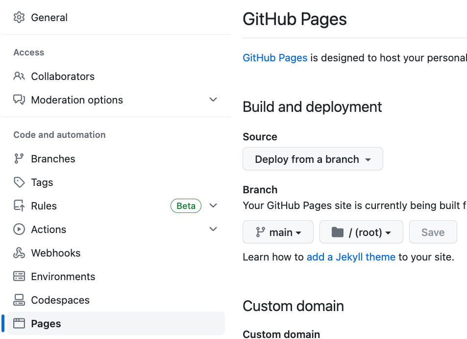

# Minimal NiiVue Web Hosting

This repository provides minimal web hosting for [NiiVue](https://github.com/niivue/niivue). Hosting data on the web is tricky, as there are restrictions to protect privacy. For example, you can not simply put a NIfTI image into Google Drive and view the link with NiiVue as this intentionally lacks a [Cross-Origin Resource Sharing (CORS)](https://developer.mozilla.org/en-US/docs/Web/HTTP/CORS) policy.

First, create a Github repository with the NIfTI images you wish to view online.

Second, go to the Settings for the repository and set the Github pages to deploy from your main brain:

Now your NIfTI images are being shared. For example, this repository is at [https://github.com/neurolabusc/niivue_volumes](https://github.com/neurolabusc/niivue_volumes) and it has a NIfTI image named `fslt.nii.gz` which is hosted on the web as `https://neurolabusc.github.io/niivue_volumes/fslt.nii.gz`. This allows any user to load your image.

Try out the [live demo](https://neurolabusc.github.io/niivue_volumes/) for the data shared on here using the repository's `index.html` file.
